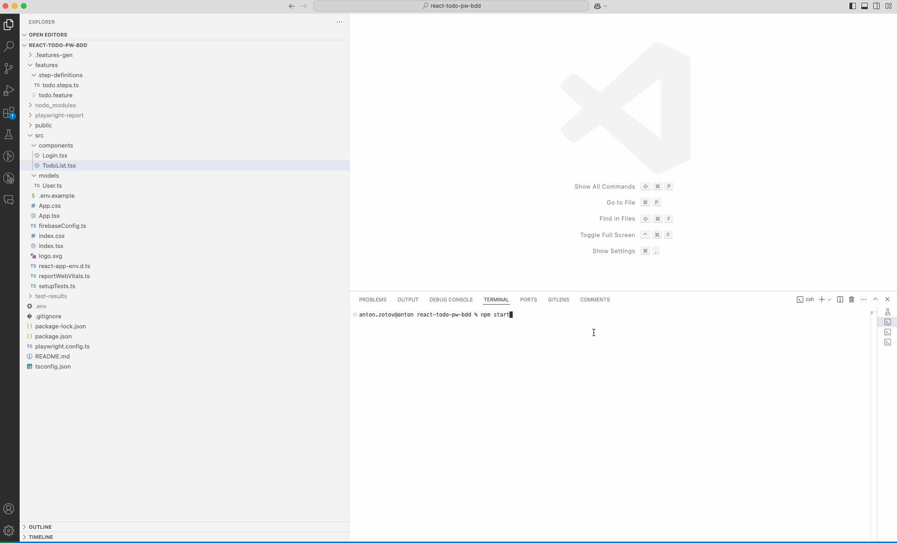

# Todo App

This is a Todo application built with React and Firebase for authentication. It includes end-to-end tests using Playwright and Playwright-BDD.

## Demo



## Prerequisites

Before you begin, ensure you have met the following requirements:

- You have installed [Node.js](https://nodejs.org/) and [npm](https://www.npmjs.com/).
- You have a Firebase account and project set up. Follow the steps in the [Firebase Setup](#firebase-setup) section.

## Firebase Setup

1. Go to the [Firebase Console](https://console.firebase.google.com/).
2. Create a new project or select an existing project.
3. Add a new web app to your project.
4. Copy the Firebase configuration object and add the values to your `.env` file.

## Installation

1. Clone the repository:

   ```sh
   git clone https://github.com/antonzotovdtex/react-todo-pw-bdd.git
   cd react-todo-pw-bdd
   ```

2. Install the dependencies:

   ```sh
   npm install
   ```

3. Install Playwright:

   ```sh
   npx playwright install
   ```

## Configuration

1. Copy the `.env.example` file to `.env`:

   ```sh
   cp .env.example .env
   ```

2. Open the `.env` file and add your Firebase configuration:

   ```env
   REACT_APP_FIREBASE_API_KEY=your_api_key
   REACT_APP_FIREBASE_AUTH_DOMAIN=your_auth_domain
   REACT_APP_FIREBASE_PROJECT_ID=your_project_id
   REACT_APP_FIREBASE_STORAGE_BUCKET=your_storage_bucket
   REACT_APP_FIREBASE_MESSAGING_SENDER_ID=your_messaging_sender_id
   REACT_APP_FIREBASE_APP_ID=your_app_id

   TEST_USER_EMAIL=test@example.com
   TEST_USER_PASSWORD=password
   TEST_HOST=http://localhost:3000
   ```

3. Ensure your `firebaseConfig.ts` file uses the environment variables:

   ```ts
   // src/firebaseConfig.ts
   import { initializeApp } from 'firebase/app';
   import { getAuth } from 'firebase/auth';

   const firebaseConfig = {
     apiKey: process.env.REACT_APP_FIREBASE_API_KEY,
     authDomain: process.env.REACT_APP_FIREBASE_AUTH_DOMAIN,
     projectId: process.env.REACT_APP_FIREBASE_PROJECT_ID,
     storageBucket: process.env.REACT_APP_FIREBASE_STORAGE_BUCKET,
     messagingSenderId: process.env.REACT_APP_FIREBASE_MESSAGING_SENDER_ID,
     appId: process.env.REACT_APP_FIREBASE_APP_ID,
   };

   const app = initializeApp(firebaseConfig);
   export const auth = getAuth(app);
   ```

## Creating a Testable User in Firebase

1. Go to the [Firebase Console](https://console.firebase.google.com/).
2. Select your project.
3. In the left sidebar, go to "Authentication" and then the "Users" tab.
4. Click on "Add user".
5. Enter an email and password for the test user (e.g., `test@example.com` and `password`).
6. Click "Add user" to create the user.

## Running the Application

1. Start the development server:

   ```sh
   npm start
   ```

2. Open your browser and navigate to `http://localhost:3000`.

## Running Tests

### Playwright and Playwright-BDD

1. Ensure you have installed Playwright and Playwright-BDD:

   ```sh
   npm install @playwright/test playwright-bdd
   ```

2. Create the necessary directories and files for your tests:

   - `features/todo.feature`
   - `steps/todo.steps.ts`
   - `tests/todo/todo.test.ts`

3. Update your `playwright.config.ts` file to include the BDD configuration:

   ```ts
   import { defineConfig } from '@playwright/test';
   import { defineBddConfig } from 'playwright-bdd';
   import dotenv from 'dotenv';

   dotenv.config();

   const testDir = defineBddConfig({
     features: './features/*.feature',
     steps: './features/**/*.ts', // Path to your step definitions
   });

   export default defineConfig({
     use: {
       baseURL: process.env.TEST_HOST, // Adjust the base URL as needed
     },
     projects: [
       {
         name: 'todo',
         testDir: testDir, // Directory for todo tests
       },
     ],
   });

   defineBddConfig({
     paths: ['features/**/*.feature'], // Path to your feature files
     require: ['steps/**/*.steps.ts'], // Path to your step definitions
   });
   ```

4. Run the Playwright tests:

   ```sh
   npm run e2e
   ```

5. Generate and view the HTML report:

   ```sh
   npm run report
   ```

## License

This project is licensed under the MIT License - see the [MIT License](https://opensource.org/licenses/MIT) file for details.
